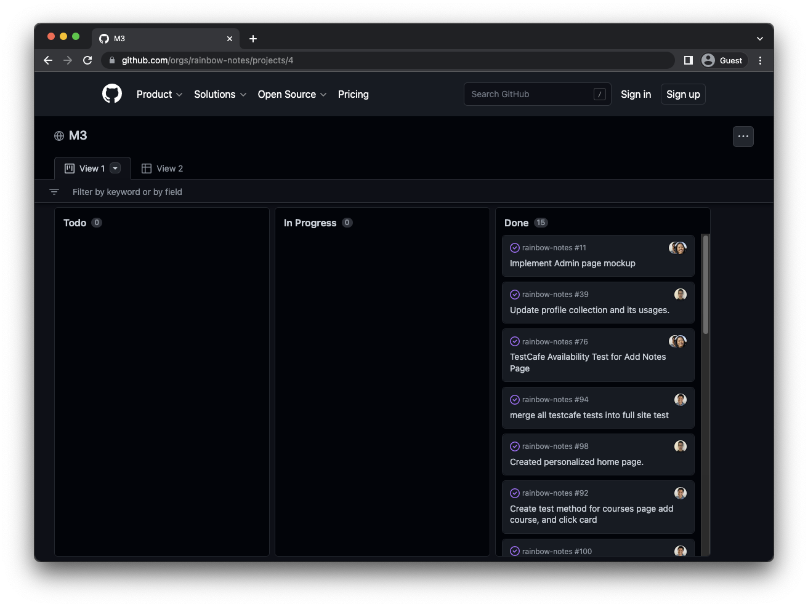

During the Fall 2022 semester, I took my first Software Engineering class and looking back, it was not an easy journey. There were many times where I struggled to comprehend a topic, one example being when we first started the HTML and CSS modules. Only after countless hours of practicing was I eventually able to learn the basics and even now I am continuing to improve despite the class being finished. In the end, we learned quite a bit of skills which I think are useful even in fields not related to this class. There are three skills which I wanted to focus on in particular. Overall, I really enjoyed the learning process and this was my favorite class of the semester. 

## Development Environments

Before the start of the semester, the only coding environment I was comfortable with was Vim. I had never touch an Integrated Development Environment (IDE) and so this class was a big eye opener for me. In the middle of the semester, we started using IntelliJ Idea as our IDE and started developing web applications with HTML and CSS, later branching into Bootstrap, React, and Meteor as well. I had trouble navigating at first since all I had ever known was the command line. However, I also really enjoy learning about all of the convenient commands that could make my workflow smoother and more efficient. In the end, I think that using an IDE is a great skill to have and I will keep using it in the future. I am also hoping to learn how to use another IDE for my Engineering classes which are done in C or C++. Although I still think Vim is great, it can't beat the convenience of a great IDE like IntelliJ Idea.

## Coding Standards

I mentioned this in a previous essay, but I feel that coding standards are probably one of the most helpful things that I have learned through his class. As an addition to our IDE, it just makes code much more consistent and readable. It really helped development of our Rainbow Notes final group project since everyone in the team followed the same conventions. Due to ESLint our code remained legible and easy to understand despite multiple people working on it. I could definitely see the use of this in a professional workspace that consists of much more complex code and much larger teams. In the future, I will also try to make my code more readable even when not restricted by a coding standard since clean code is beneficial to everyone.

## Issue Driven Project Management (IDPM)

During the Rainbow Notes final project, our team used a process called Issue Driven Project Management (IDPM). In a sense, it is similar to coding standards since the basic idea is to organize the development of a project in a way that make it easy for many people to work on at the same time. An example of how we used this in our Rainbow Notes project can be seen below. 

IDPM guidelines:
<ul>
<li>Meeting twice a week to review progress and update tasks</li>
<li>Dividing work into 72 hour tasks</li>
<li>Documenting individual tasks as a GitHub issue</li>
<li>Performing work for a task in its own branch</li>
<li>Branch titles should all follow the same convention</li>
<li>Manage progress of project with milestones</li>
<li>Use GitHub projects to manage progress within a milestone</li>
</ul>

I think that this is just as important as coding standards because without it, I can guarantee that our GitHub repository would have been an absolute mess. I am a person who likes consistency and group projects can bother me since everyone has their own way of doing things. The IDPM guidelines made managing our project a breeze since everyone was clear on the issues that needed to been done. In fact, this was the first group project where I didn't need to remind teammates to do something. Overall, I can definitely see using this in future programming team projects or even some sort of simpler variation without GitHub for all of my other classes.