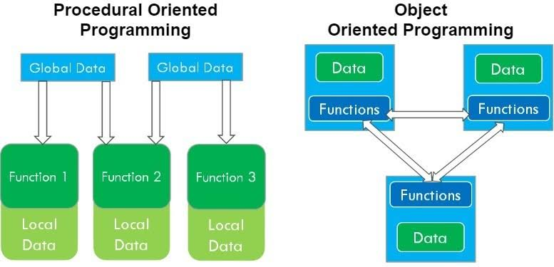

 My interest in programming was first developed through AP Computer Science during my Junior year at Moanalua High School. The class, which was in Java, was also my first experience with programming and I really enjoyed it. It was because of this class that I decided to major in Computer Engineering. Later during my second semester at UH Manoa, EE 205 - Object Oriented Programming further reinforced my desire to pursue this career path. It was my first time learning about the amazing things you could do with object-oriented programs when compared to procedural programs. My eyes were opened to the fact that the world of programming is more complex than I could ever imagine. After the Fall 2022 semester concludes, I hope that I will be able to look back and see that the ICS 314 - Software Engineering class provided me with new knowledge and skills that will help me to be successful.

## Skills

Now as a Junior in college, I would like to believe that I have gotten better at programming. I know that I still have a long way to go, but I think that the programming skills that I have built in the past few years are pretty decent. However, despite my improvement in those areas, I still know next to nothing about the process of Software Engineering, which is why I am excited to take the ICS 314 class. I want to learn more about everything including the design process as well as the developing, testing, and maintenance of software. I also hope to build a strong foundation in JavaScript, CSS, and HTML since I have never experienced those languages before. Finally, I would also like to learn how to use an Integrated Development Environment (IDE) since I have basically only used vim for all of my previous classes. These several skills will definitely be helpful in this career path and I regret not learning and developing them earlier.

## Goals
As a beginner in Software Engineering, I will try to set realistic goals for myself. I will probably not create a complex application, but I hope to create at least one program which can be used in a real life situation. Some ideas that come to mind might be a personal website such as this one, which I could give to recruiters or take to the Career Fair. I also want to experience what it is like to develop a piece of software from scratch and to maybe even publish it somewhere. These are still far in the future, but one of my immediate goals is to keep up with the course material. Since I am learning multiple new programming languages in this class, I think that it will be difficult and I hope to not fall behind. These are my main three goals for the ICS 314 class and my development in the near future.

