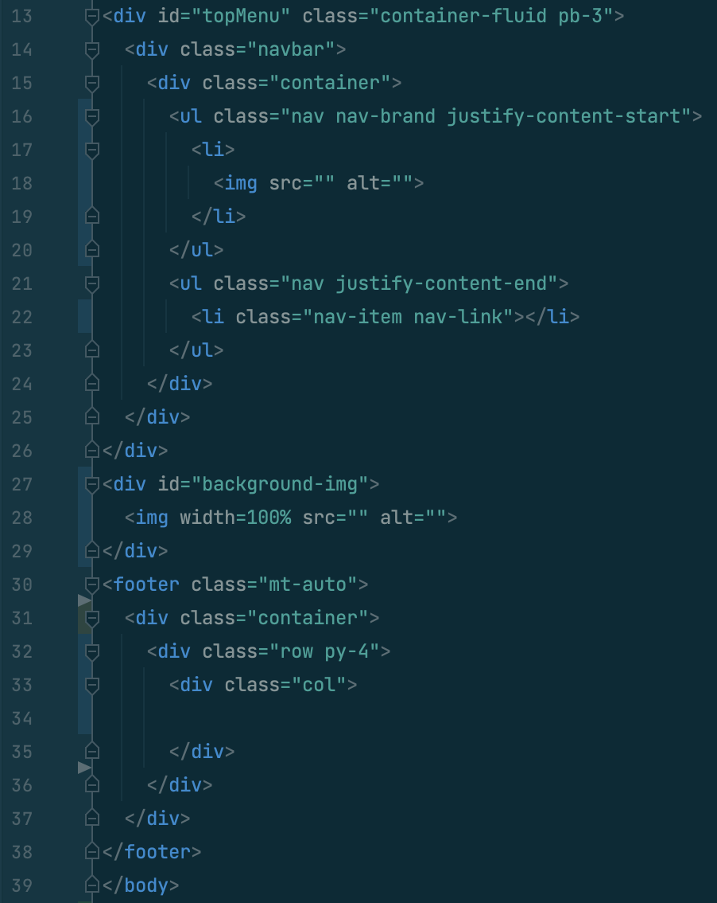

The User Interface (UI) is the space where the user interacts with the computer and it is essential for daily life as we constantly access websites or applications through it. However, developing these websites and applications often require extensive knowledge of programming languages such as HyperText Markup Language (HTML) and Cascading Style Sheets (CSS). With just these two languages, web development can be extremely difficult and time consuming, and that is where UI frameworks come in as they are extremely helpful in aiding the creation process.

## UI Frameworks

UI frameworks are software tools that are used to build web programs in a more efficient manner. They are similar to libraries in other programming languages and are essentially a foundation which can be easily built upon to make web applications. UI frameworks often include helpful organization and styling templates for common components like forms, buttons, and navigation bars. Bootstrap 5, which we have started learning in my ICS 314 class, is an example of a UI framework.

Learning to use a framework can be just as difficult as learning a new programming language, so why should we learn it? Is it also worth the time and effort put in? After a week with Bootstrap 5 and struggling to design several website homepages like the one seen below, I think that there are several reasons why it was a great time investment and is important to learn.

## Reasons to Use a UI Framework 

<ul>
<li>
Similar to coding standards in that it is great for a team environment. When developing a web application in this sort of setting, it is easier to understand code when everyone in the team uses the same set of tools. For example, when looking at a friend's code, I could immediately see any problems and try to help them since our code was similar in design.
</li>

<li>
Simple, repetitive designs are much easier to implement with the built in methods of a framework. Repetitive tasks like creating tables and navigation bars are much easier with Bootstrap when compared to pure HTML and CSS. For example, most of our WODs are to recreate a website homepage which consists of a navigation bar, a background image, and a footer. After learning about Bootstrap 5, most websites we did had similar templates to the one seen on the right.
</li>

<li>
They allow websites to look professional and clean without too much effort put in. Rather than worrying about customizing each portion of a website, developers can choose from the various built in components such as buttons, dropdown menus, and especially containers. Once again, this saves the time and effort which can be spent somewhere else. 
</li>
</ul>

## Conclusion
At the time of writing this, it has been two weeks since I started learning about HTML and CSS, as well as a week since I picked up my first UI Framework, Bootstrap 5. I have never done any sort of web development before this and so it was an eye-opener for me. Despite the struggles, I really enjoyed how we were able to create various website homepages, which is something I could never imagine doing with my previous programming languages. I think that UI Frameworks are very powerful tools and are a necessity as the world continues to rely more on the digital world. They make the lives of web developers much easier although there are some caveats like the learning curve. In the end, it is up to an individual to decide whether using a framework like Bootstrap 5 will be beneficial or not. 
