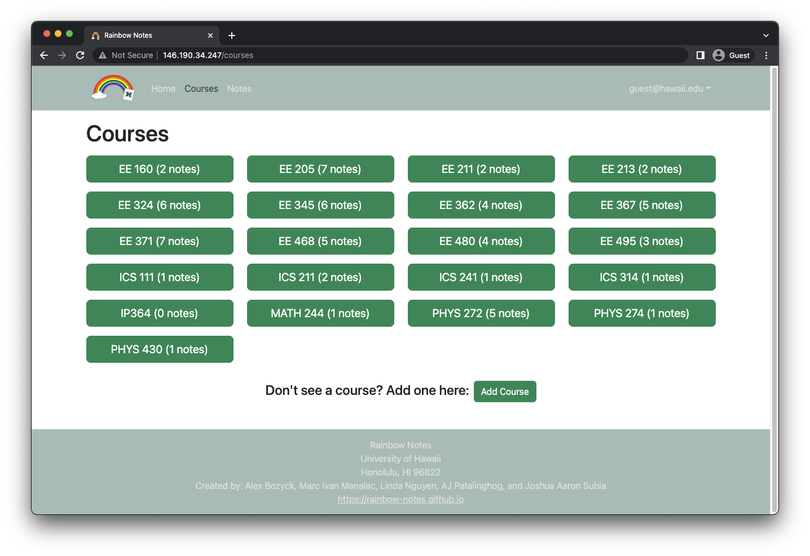
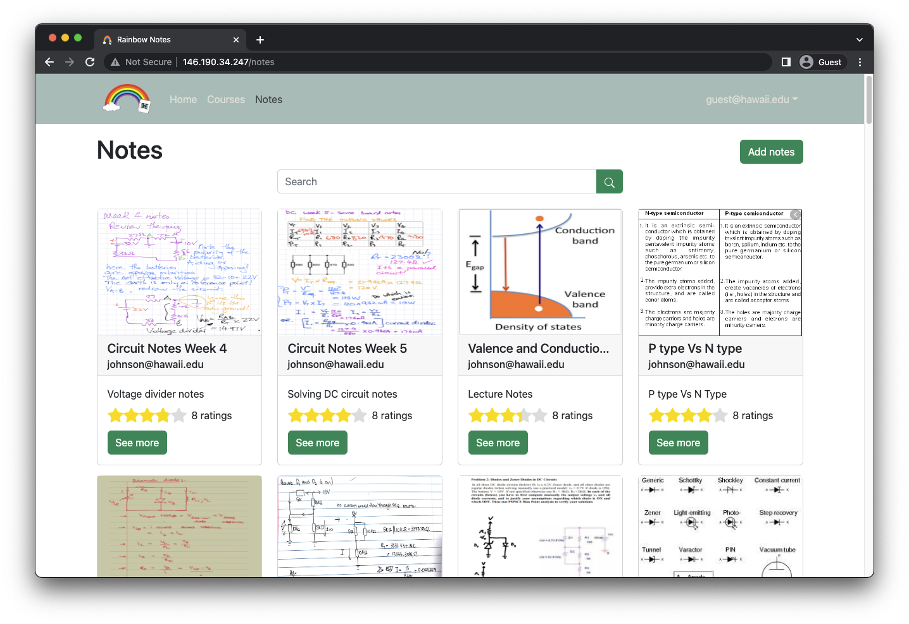

Rainbow Notes is an application that was developed as a final project in my ICS 314 Software Engineering Development class. The goal was to provide students a place where they can find notes of other students who previously took a course. As an archive, it also forms a community where future students can refer to as well. 

## Development

A month before the Fall 2022 semester ended, we were assigned a group final project and asked to choose from a given list of generic ideas or to come up with our own. Taking inspiration from Chegg and other similar services, I came up with the idea of a note sharing app for UH students. Since I frequently ask for advice or notes from older students, I realized there was no effective way other than through personal connections. It would be much more convenient to have a dedicated website and the end result is the Rainbow Notes app. More information about the features and development can be found on the [Rainbow Notes](https://rainbow-notes.github.io) website. 

## My Contributions

For this project, my group distributed work through the use of GitHub projects and issues. Tasks were each given an individual issue and branch where we could work on issues depending on our individual strengths. Overall, I found the organization of tasks to be really helpful for keeping track of the progress as well as who did what. I mainly worked on development of the website pages which also included utilizing the MongoDB collections that we defined.

An example is the Courses page which reads from a MongoDB collection called CoursesCollection and stores them in an array of objects. Each course is then mapped to a button containing the course name and when clicked, will redirect you to the individual course page containing notes from that class. Each button also features the amount of notes within a course which was done by filtering through another collection called NotesCollection to find ones that matched the course title.

Another major part that I worked on was the Notes page which listed all of the notes as a series of cards. Similarly to the process above, it takes a note from the NotesCollection and then maps it to a card component. Creating nice and symmetrical cards was difficult as the length of the note titles or description were all different. I also had to render the ratings for each note which was done by filtering through the RatingsCollection and then taking the average.

## Conclusion

I really enjoyed developing this application and working with my group on this project. Although there wasn't that much time, we were still able to complete the basic structure and implement other additional features like an administration role and ratings for each note. I think that given enough time, we could easily improve the functionality of several features like viewing other profiles or favoriting notes for easy access. In the end, I am pretty happy with the result and Rainbow Notes is my favorite project by a long shot. I could even see working on this in the future for fun in order to implement more ideas and improvements.
